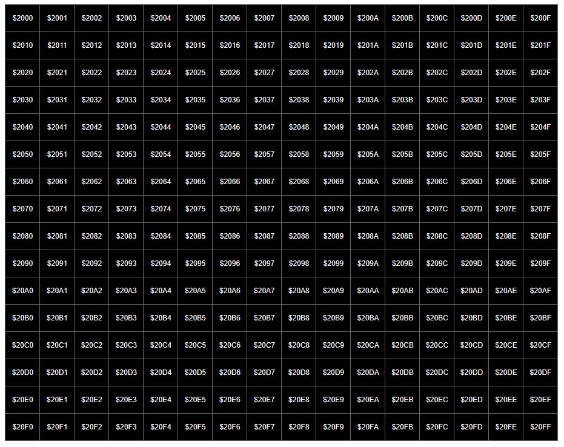
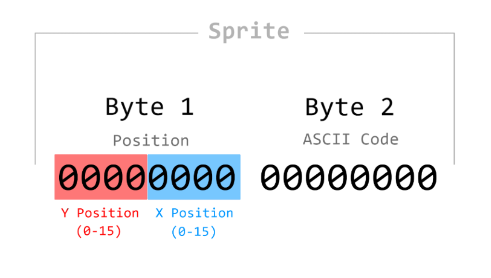
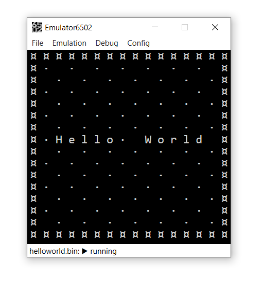
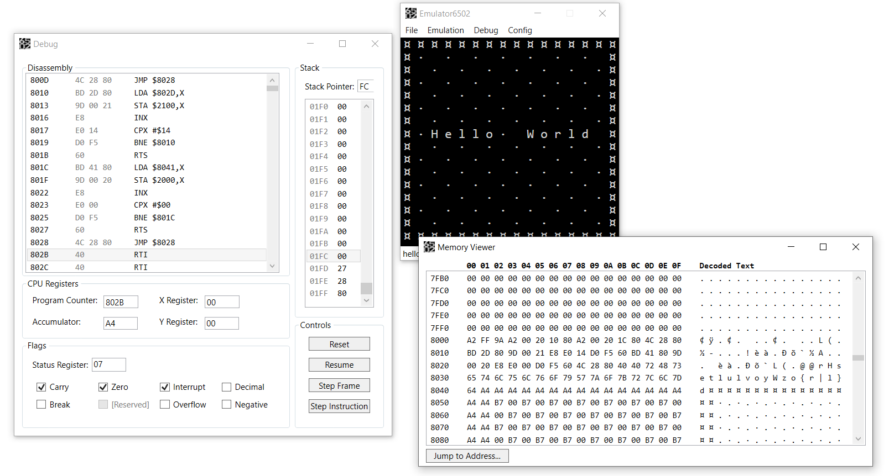
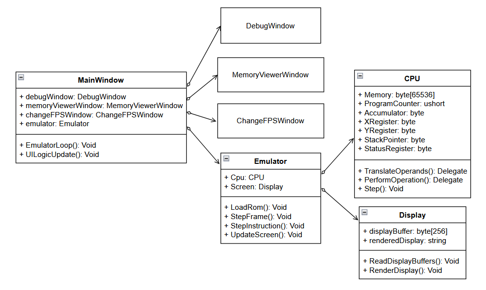

# Emulator6502 Documentation

## Table of Contents
1. [Overview](#overview)
    - [Features](#features)
2. [Memory Map](#memory-map)
    - [ROM](#rom)
    - [Graphics](#graphics)
      - [Background Buffer](#background-buffer)
      - [Sprite Buffer](#sprite-buffer)
    - [Input](#input)
3. [Usage Example](#usage-example)
    - [Code](#code)
      - [Template](#template)
      - [Hello World](#hello-world)
      - [Final Program](#final-program)
    - [Assembling](#assembling)
    - [Running](#running)
    - [Debugging](#debugging)
1. [Implementation](#implementation)
    - [Summary](#summary)

# Overview

## Features

Emulator6502 is a MOS 6502 CPU emulator written in C#, with debugging tools for it made using the WPF UI framework. It simulates a CPU core programmatically with accurate register, memory, and flag behavior, enabling programs written for the original hardware to execute within the emulator. 

It also has memory-mapped I/O, allowing for programs involving graphics and user input.

# Memory Map


## ROM

This system uses a fairly standard 6502 memory map, somewhat reminiscent of the NES's, but simplified.  The ROM sits in the 32 KB from $8000-$FFFF, with support for mirroring 16 KB and 8 KB ROMs. If using an 8/16 KB ROM, make sure to place the vector bytes at the correct spot at the end of the ROM to ensure they appear to the CPU at $FFFA-$FFFF when mirrored.

## Graphics

Text can be drawn to the ASCII display by using the two graphics buffers located from $2000-$21FF. 

### Background Buffer

The background buffer is rendered first, placing characters to the screen starting at $2000 (the upper left corner), moving left-to-right and top-to-bottom until $20FF (the bottom right corner). Each character placed is the ASCII character associated with the value at the given address.



### Sprite Buffer

The sprite buffer can overwrite characters from the background, allowing characters to easily be drawn at any position on the screen. The sprite buffer has room for 128 sprites, each using two adjacent bytes. The first byte of each sprite is for its screen position, and the second byte is for its ASCII code. Sprites with an ASCII code of 0 (the default value) are transparent, and will thus not overwrite the background. Z-ordering of sprites is decided by their relative placement within the buffer, with $2100 being the lowest priority sprite.



## Input

The user can control programs using memory-mapped keyboard input. While a key pressed, the value at the memory address $4000 + the key's uppercase ASCII code will be set to 1, and when released, will be return to 0. For instance, while the user holds down the 'M' key—ASCII code 0x4D—address $404D will be 1. The state of the arrow keys arrow keys can be found between $4000-$4003, for up, down, left, and right respectively. 

# Usage Example

## Code

### Template

Here is a general template outlining the structure of a 6502 assembly program written for this emulator. 
```assembly
.ORG $8000

reset:
  ;arrange initial startup state
  JMP main_loop

main_loop:
  ;logic that loops continuously
  JMP main_loop

nmi:
  ;logic that occurs once every frame
  RTI

irq:
  ;interrup handler
  RTI

.ORG $FFFA
.WORD nmi
.WORD reset
.WORD irq
```
The assembly code can also be found in the [template.asm file](ExamplePrograms/Assembly/template.asm).

Currently this program will not visibly do much. However, that can be changed by writing code targeting the graphics buffers.

### Hello World

In order to draw text to the screen, either the background buffer or sprite buffer can be used. For the sake of being thorough, usage of both graphics buffers will be shown.

First, the background buffer. Using the background buffer is simple; each byte represents one character of the 16x16 text display. Fill each byte with the ASCII code of the desired character for that cell. 

Here is an example of background data for a pattern and border:
```assembly
background:
  .BYTE $A4, $A4, $A4, $A4, $A4, $A4, $A4, $A4, $A4, $A4, $A4, $A4, $A4, $A4, $A4, $A4
  .BYTE $A4, $B7, $00, $B7, $00, $B7, $00, $B7, $00, $B7, $00, $B7, $00, $B7, $00, $A4
  .BYTE $A4, $00, $B7, $00, $B7, $00, $B7, $00, $B7, $00, $B7, $00, $B7, $00, $B7, $A4
  .BYTE $A4, $B7, $00, $B7, $00, $B7, $00, $B7, $00, $B7, $00, $B7, $00, $B7, $00, $A4
  .BYTE $A4, $00, $B7, $00, $B7, $00, $B7, $00, $B7, $00, $B7, $00, $B7, $00, $B7, $A4
  .BYTE $A4, $B7, $00, $B7, $00, $B7, $00, $B7, $00, $B7, $00, $B7, $00, $B7, $00, $A4
  .BYTE $A4, $00, $B7, $00, $B7, $00, $B7, $00, $B7, $00, $B7, $00, $B7, $00, $B7, $A4
  .BYTE $A4, $B7, $00, $B7, $00, $B7, $00, $B7, $00, $B7, $00, $B7, $00, $B7, $00, $A4
  .BYTE $A4, $00, $B7, $00, $B7, $00, $B7, $00, $B7, $00, $B7, $00, $B7, $00, $B7, $A4
  .BYTE $A4, $B7, $00, $B7, $00, $B7, $00, $B7, $00, $B7, $00, $B7, $00, $B7, $00, $A4
  .BYTE $A4, $00, $B7, $00, $B7, $00, $B7, $00, $B7, $00, $B7, $00, $B7, $00, $B7, $A4
  .BYTE $A4, $B7, $00, $B7, $00, $B7, $00, $B7, $00, $B7, $00, $B7, $00, $B7, $00, $A4
  .BYTE $A4, $00, $B7, $00, $B7, $00, $B7, $00, $B7, $00, $B7, $00, $B7, $00, $B7, $A4
  .BYTE $A4, $B7, $00, $B7, $00, $B7, $00, $B7, $00, $B7, $00, $B7, $00, $B7, $00, $A4
  .BYTE $A4, $00, $B7, $00, $B7, $00, $B7, $00, $B7, $00, $B7, $00, $B7, $00, $B7, $A4
  .BYTE $A4, $A4, $A4, $A4, $A4, $A4, $A4, $A4, $A4, $A4, $A4, $A4, $A4, $A4, $A4, $A4
```

Next, the sprite buffer. Each character is its own sprite, and each sprite takes two bytes. One for the position, and one for the ASCII code. Because the sprite's position is a byte—as opposed to being a result of the data's placement within the buffer, like with the background—the order of sprites within the sprite buffer is somewhat arbitrary. Consider the classic 'hello world' example. With each letter being a sprite, and each sprite being two bytes, that is 10 sprites and 20 bytes.

Here is the sprite data for "Hello World" shown in assembly:
```assembly
sprites:
  .BYTE $72, $48 ;H
  .BYTE $73, $65 ;e
  .BYTE $74, $6C ;l
  .BYTE $75, $6C ;l
  .BYTE $76, $6F ;o
  .BYTE $79, $57 ;W
  .BYTE $7A, $6F ;o
  .BYTE $7B, $72 ;r
  .BYTE $7C, $6C ;l
  .BYTE $7D, $64 ;d
```

Although the data for the graphics is present in the code, there is currently nothing putting that data within the graphics buffers in RAM. This can be achieved by looping over the data and copying it to the relevant addresses.

Here is a loop to copy the sprite data into the sprite buffer:
```assembly
load_sprites:
  LDA sprites,X
  STA $2100,X 
  INX
  CPX #20 ;20 sprite bytes
  BNE load_sprites
  RTS
```
A very similar loop can be used to copy over the background data as well. 

### Final Program
Here is the full code to display "Hello World" over a patterned background:
```assembly
.ORG $8000

reset:
  LDX #$FF
  TXS
  LDX #$00
  JSR load_sprites
  LDX #$00
  JSR load_background
  JMP main_loop

load_sprites:
  LDA sprites,X
  STA $2100,X 
  INX
  CPX #20 ;20 sprite bytes
  BNE load_sprites
  RTS

load_background:
  LDA background,X
  STA $2000,X 
  INX
  CPX #$00 ;256 background bytes
  BNE load_background
  RTS

main_loop:
  JMP main_loop

nmi:
  RTI

irq:
  RTI

sprites:
  .BYTE $72, $48 ;H
  .BYTE $73, $65 ;e
  .BYTE $74, $6C ;l
  .BYTE $75, $6C ;l
  .BYTE $76, $6F ;o
  .BYTE $79, $57 ;W
  .BYTE $7A, $6F ;o
  .BYTE $7B, $72 ;r
  .BYTE $7C, $6C ;l
  .BYTE $7D, $64 ;d

background:
  .BYTE $A4, $A4, $A4, $A4, $A4, $A4, $A4, $A4, $A4, $A4, $A4, $A4, $A4, $A4, $A4, $A4
  .BYTE $A4, $B7, $00, $B7, $00, $B7, $00, $B7, $00, $B7, $00, $B7, $00, $B7, $00, $A4
  .BYTE $A4, $00, $B7, $00, $B7, $00, $B7, $00, $B7, $00, $B7, $00, $B7, $00, $B7, $A4
  .BYTE $A4, $B7, $00, $B7, $00, $B7, $00, $B7, $00, $B7, $00, $B7, $00, $B7, $00, $A4
  .BYTE $A4, $00, $B7, $00, $B7, $00, $B7, $00, $B7, $00, $B7, $00, $B7, $00, $B7, $A4
  .BYTE $A4, $B7, $00, $B7, $00, $B7, $00, $B7, $00, $B7, $00, $B7, $00, $B7, $00, $A4
  .BYTE $A4, $00, $B7, $00, $B7, $00, $B7, $00, $B7, $00, $B7, $00, $B7, $00, $B7, $A4
  .BYTE $A4, $B7, $00, $B7, $00, $B7, $00, $B7, $00, $B7, $00, $B7, $00, $B7, $00, $A4
  .BYTE $A4, $00, $B7, $00, $B7, $00, $B7, $00, $B7, $00, $B7, $00, $B7, $00, $B7, $A4
  .BYTE $A4, $B7, $00, $B7, $00, $B7, $00, $B7, $00, $B7, $00, $B7, $00, $B7, $00, $A4
  .BYTE $A4, $00, $B7, $00, $B7, $00, $B7, $00, $B7, $00, $B7, $00, $B7, $00, $B7, $A4
  .BYTE $A4, $B7, $00, $B7, $00, $B7, $00, $B7, $00, $B7, $00, $B7, $00, $B7, $00, $A4
  .BYTE $A4, $00, $B7, $00, $B7, $00, $B7, $00, $B7, $00, $B7, $00, $B7, $00, $B7, $A4
  .BYTE $A4, $B7, $00, $B7, $00, $B7, $00, $B7, $00, $B7, $00, $B7, $00, $B7, $00, $A4
  .BYTE $A4, $00, $B7, $00, $B7, $00, $B7, $00, $B7, $00, $B7, $00, $B7, $00, $B7, $A4
  .BYTE $A4, $A4, $A4, $A4, $A4, $A4, $A4, $A4, $A4, $A4, $A4, $A4, $A4, $A4, $A4, $A4

.ORG $FFFA
.WORD nmi
.WORD reset
.WORD irq
```
The assembly code can also be found in the [helloworld.asm file](ExamplePrograms/Assembly/helloworld.asm).

## Assembling

Like any other CPU, the 6502 runs binary machine code, not assembly. In order to turn the assembly into machine code, it must be assembled using an assembler. There are many 6502-compatible assemblers. A very approachable one is the [Masswerk virtual assembler](https://www.masswerk.at/6502/assembler.html). You can assemble the code using the instructions on the site, and download the resulting .bin file.

## Running

Once a program has been assembled to a .bin file, it can be loaded as a ROM within the emulator. Open Emulator6502, click "File"->"Load ROM", and select the .bin file.



Once a program is loaded, the user can pause it, reset it, step over instructions or frames, and create and load savestates.

## Debugging

Emulator6502 has debug features to look within the CPU and its memory while it is running. The debug window provides a disassembly (machine code turned back into assembly), viewing and editing of CPU registers and flags, and a look at the stack. The memory viewer shows every byte in the 64 KB of addressable memory, both in hex and in text form. The user can jump to any address between $0000-$FFFF. These features can help the user understand the inner workings of the 6502, and help debug programs being written for it.



# Implementation

## Summary



While this diagram is not a complete look into the implementation (it does not show all classes, nor all of the members of each class), it should give a general idea of the structure of the program. 

The MainWindow is what turns UI interaction into method calls, and is what governs the 2 computation threads (emulation logic and UI source updating). 

The Emulator handles ROM loading, frame timing, instruction counting, and coordination of the CPU and Display. 

The CPU stores the state of the registers, flags, and memory. It translates opcodes into addressing mode methods and instruction methods, which it uses to manipulate data and program execution.

The Display reads the graphics buffers from the CPU, and renders them into a 16x16 ASCII string to be displayed on screen on the next frame.

[Back to Top](#emulator6502-documentation)
