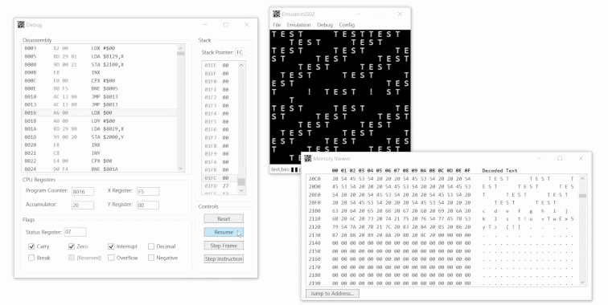
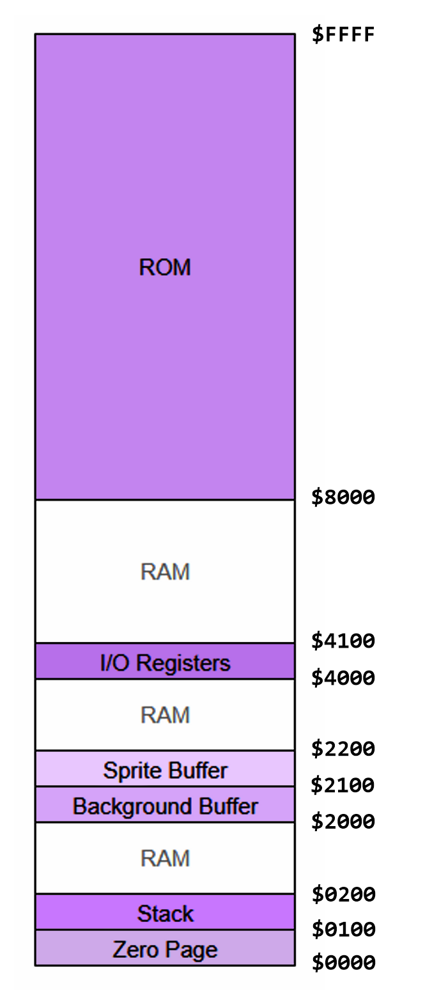

# Emulator 6502

6502 emulator with I/O and debugging features, written in C#.



## Features

- Execution of assembled 6502 code
- 16x16 ASCII display with sprite and background layers
- Memory-mapped keyboard input
- Savestates
- Stepping over code (by frame and by instruction)
- Debug window with disassembly and editable CPU state
- Live memory viewer

## Installation

To install and run a built version of the project, navigate to the Releases section and download the most recent release. Unzip the compressed folder, and run the 'Emulator6502' executable from within it.

## Setting up Dev

Make sure that you have .NET 8.0 (Core) and .NET Framework 4.7 or higher installed.

Run this command to clone the repository to your machine.

```shell
git clone https://github.com/Ztel/6502-emulator-csharp c:/users/user/projectfolder
```

This will create a local copy of the repository at a location of your choice.

Open up Visual Studio or JetBrains Rider, navigate to the newly cloned folder, and open the solution file.

Click on the Source Control tab for GitHub-related features.
    
## Documentation

The full documentation with more diagrams, details, and example code can be found in the [documentation.md](DOCUMENTATION.md) file. Here is a brief overview:

Emulator6502 is a MOS 6502 CPU emulator written in C#, with debugging tools for it made using the WPF UI framework. It simulates a CPU core programmatically with accurate register, memory, and flag behavior, enabling programs written for the original hardware to execute within the emulator.



It has memory-mapped I/O, allowing for programs involving graphics and user input. Text can be drawn to the ASCII display by using the two graphics buffers located from $2000-$21FF, and the user can control programs using memory-mapped keyboard input.


## Acknowledgements

This project would not have been possible without the in-depth documentation of 6502 hardware and assembly from these resources:
 - [Obelisk 6502 documentation](http://www.6502.org/users/obelisk/6502/)
 - [NesDev instruction reference](https://www.nesdev.org/wiki/Instruction_reference)
 - [Masswerk instruction reference](https://www.masswerk.at/6502/6502_instruction_set.html)
